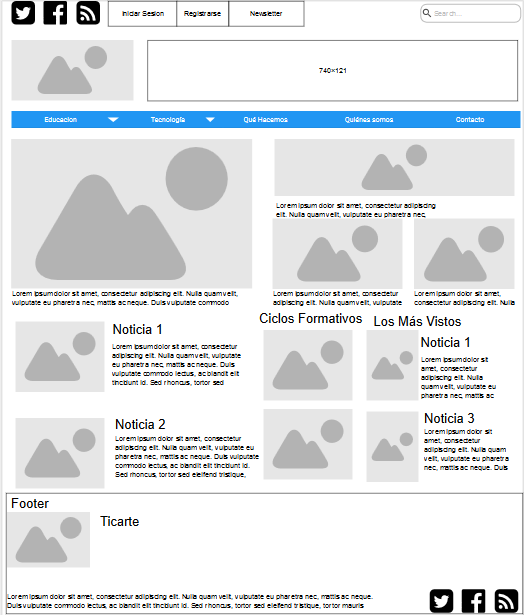

# Examen UD 4 HTML

Nos han proporcionado un boceto para hacer la plantilla de estilos de la página de una empresa.

Elabora el documento HTML y la plantilla CSS para distribuir el contenido.

No tengas en cuenta:

- Tipo de letra, color, tamaño, etc
- Fondo, color, tamaño, etc
- Estilos visuales de los enlaces
- Imagen de la lupa en el formulario de búsqueda. No seleccionar.

Qué debo tener en cuenta:

- Distribución de los contenidos
- Enlaces a otras páginas 
- Formulario de búsqueda
- Las imágenes son cuadrados de color gris, con esquinas redondeadas.
- Para las imágenes emplear la etiqueta `` con el modificador `width`

Suerte.